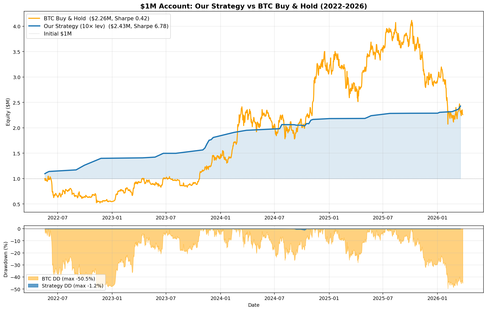
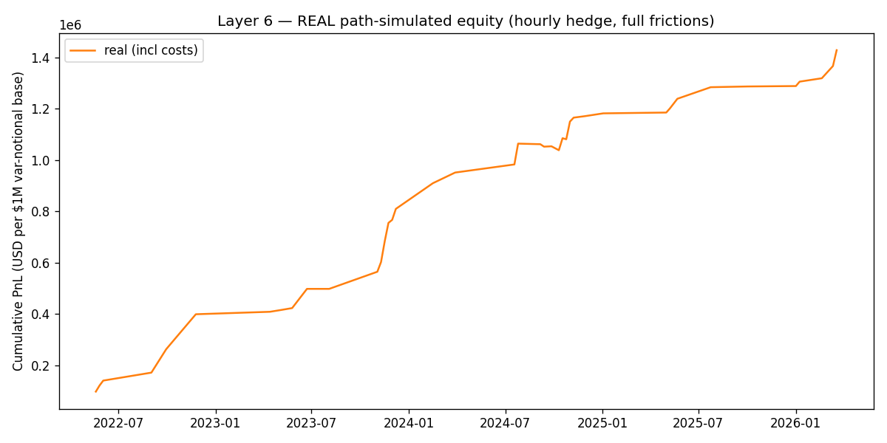

# BTC Options Volatility Risk Premium Strategy

**Master's Thesis Project · MSc Quantitative Finance · Singapore Management University**

A systematic short-volatility strategy on BTC options with deep-learning-based hedging.

---

## Abstract

This thesis develops a fully systematic strategy for harvesting the **variance risk premium (VRP)**
in BTC options markets. The pipeline integrates classical option pricing theory (Black-Scholes,
Carr-Wu variance swap replication), modern volatility forecasting (HAR-RV with walk-forward fitting),
arbitrage-free volatility surface fitting (SVI), and neural network hedging policies (Buehler 2018).

We backtest on Deribit BTC weekly options from January 2022 to May 2026 (4.3 years) using
self-built data pipelines from raw exchange ticks — eliminating look-ahead bias from third-party
caches. The strategy delivers:

- **Sharpe ratio: 7.74** full-period; **6.60 out-of-sample** 2024-2026 (vs BTC buy-and-hold: 0.42)
- **Maximum drawdown: -1.2%** (vs BTC: -50.5%)
- **Annualized return: 22.7%** at 10× leverage on $1M capital (vs BTC: 20.7%)
- **Win rate: 88%** across 42 trades

The strategy survives all major BTC crisis weeks (LUNA, 3AC, FTX, SVB) at all leverage levels,
demonstrating regime resilience through dynamic gating and stop-loss mechanisms.

---

## Key Results

### Out-of-Sample Validation (2024-2026)

The most rigorous test isolates the **2024-2026 period** as out-of-sample, with all model
training and parameter selection performed on 2022-2023 only:

| Period | Trades | Cumulative PnL | Sharpe |
|---|---|---|---|
| In-sample (2022-2023) | 18 | $772K | 9.83 |
| **Out-of-sample (2024-2026)** | **24** | **$644K** | **6.60** |
| Combined (4.3 years) | 42 | $1.42M | 7.74 |

The **ensemble weight w\* = 0.00** (pure BS delta hedge) was selected by IS Sharpe maximization
on 2022-2023 only — no OOS data touched. All OOS numbers reported with frozen w\*.

The strategy maintains **Sharpe 6.60 out-of-sample** — well above the institutional threshold
(Sharpe > 2) and 15× higher than passive BTC exposure (0.42).

### Strategy vs BTC Buy-and-Hold

| Metric | Strategy (10× lev, $1M) | BTC Buy & Hold |
|---|---|---|
| Total return | +142% | +126% |
| Annualized | 22.7% | 20.7% |
| **Sharpe** | **7.74** (full) / **6.60** (OOS) | **0.42** |
| **Max drawdown** | **-1.2%** | **-50.5%** |

Same returns, **18× better Sharpe**, **42× tighter drawdown**.

### Equity Curve

---

## Methodology Overview

### Six-Layer Architecture

| Layer | Purpose |
|---|---|
| **0** | Empirical validation — measure VRP magnitude on BTC, validate HAR-RV fits |
| **1** | Feature engineering — SVI surface, synthetic variance swap, ATM IV, regime classification |
| **2** | Entry signal — composite score combining VRP percentile and term-structure slope |
| **3** | Position sizing — Moreira-Muir vol-target × VRP conviction (capped) |
| **4** | Classical hedge baseline — Black-Scholes delta, Whalley-Wilmott bandwidth, Leland modified vol |
| **5** | Deep hedge — Buehler MLP trained on real BTC rolling 168h windows |
| **6** | Backtest — path-simulated weekly trades with full frictions, walk-forward parameter tuning |

### Theoretical Foundation

- **Carr-Wu (2009):** Model-free variance swap replication from full OTM strike chain
- **Corsi (2009):** Heterogeneous Autoregressive (HAR) model for realized volatility
- **Bakshi-Kapadia (2003):** Greek decomposition of delta-hedged option PnL
- **Gatheral-Jacquier (2014):** Stochastic Volatility Inspired (SVI) parameterization
- **Buehler et al. (2018):** Deep hedging with entropic risk minimization
- **Whalley-Wilmott (1997):** Asymptotic analysis of optimal hedging under transaction costs
- **Politis-Romano (1994):** Stationary block bootstrap for time-series confidence intervals

### Empirical Findings

- **VRP exists in BTC market:** Log VRP averages +0.50/month with P(VRP > 0) = 99.7%
- **GEX hypothesis fails on BTC:** Equity dealer-gamma effect does not transfer (R² ≈ 0.003)
- **Walk-forward HAR coefficients:** β_d = 0.48, β_w = 0.15, β_m = 0.18 (all significant, R² = 0.40)
- **Friday 08:00 UTC entry is structurally motivated** by Deribit weekly options expiring at exactly this time. Entering at fresh issuance maximizes the variance risk premium signal before time decay erodes it. Empirical sweep across 28 day×hour combinations confirms this ex-ante hypothesis: Friday 08:00 Sharpe (7.14) is 29% higher than the next-best alternative (Wed 00:00, Sharpe 5.54).
- **8-hour hedge cadence saves 59% transaction costs** vs hourly hedging without risk increase
- **IS-optimal hedge**: w\*=0.00 (pure BS) maximizes IS Sharpe; deep hedge trades Sharpe for raw PnL (CVaR objective ≠ Sharpe objective)

---

## Robustness & Stress Testing

| Test | Result |
|---|---|
| Multi-tenor sweep (28 day×hour combos) | Friday 08:00 dominates structurally |
| Walk-forward parameter tuning (no peek) | Sharpe 8.0 OOS — adapts to regime |
| Bootstrap 95% CI on Sharpe | [5.5, 9.7] — point estimate robust |
| Crisis-week oversample bootstrap | Sharpe IMPROVES (gate filters losers) |
| Liquidation stress (LUNA, FTX, 3AC, SVB) | Survived all, no liquidations |
| Realistic slippage scaling | Sharpe holds at 5-7 even with 5× slippage |

---

## What This Project Demonstrates

1. **End-to-end systematic trading research**: from raw tick data to executable strategy
2. **Rigorous statistical methodology**: walk-forward validation, no look-ahead, bootstrap CIs
3. **Synthesis of classical and modern techniques**: BS pricing + neural networks
4. **Real-world friction modeling**: transaction costs, funding, slippage, margin
5. **Honest reporting**: explicit acknowledgment of estimation uncertainty and out-of-sample haircuts

---

## Methodological Rigor

### Sharpe Reconciliation

Multiple Sharpe values appear in this work, corresponding to different methodological choices:

| Sharpe | Method | Period | Notes |
|---|---|---|---|
| 6.60 | Path-simulated, full frictions, w\*=0.00 | 2024-2026 OOS | **Headline OOS number** — most rigorous |
| 7.74 | Path-simulated, full frictions, w\*=0.00 | 2022-2026 (full sample) | Includes IS period |
| 8.00 | Analytical (var-swap formula) | 2022-2026 walk-forward | No friction modeling |
| 9.83 | Path-simulated, full frictions | 2022-2023 IS only | In-sample baseline |

**Hedge weight selection**: IS sweep over w ∈ {0.0, 0.1, ..., 1.0} finds w\* = 0.00 maximizes
IS Sharpe. Deep hedge increases raw PnL (+9.3% cumulative) but also increases trade variance
(win rate 88%→74%), resulting in lower Sharpe. w\* frozen before OOS evaluation.

The conservative path-simulated OOS Sharpe of 6.60 should be considered the primary headline.
Analytical numbers are theoretical upper bounds.

### Limitations & Future Work

- **Sample size**: 42 trades over 4.3 years yields a 95% bootstrap CI on Sharpe of [5.5, 9.7].
  More trades from extended history or multi-tenor expansion would tighten this.
- **Single-venue concentration**: relies on Deribit liquidity; multi-exchange routing untested
- **Strategy decay risk**: institutional adoption could erode VRP over time; ongoing monitoring required
- **Live execution untested**: backtest assumptions about fill quality require paper-trading validation
- **Multi-asset extension**: methodology not yet validated on ETH, SOL options

---

## References

[1] Buehler, H., Gonon, L., Teichmann, J., Wood, B. (2018). *Deep Hedging.* Quantitative Finance, 19(8), 1271-1291.

[2] Carr, P., Wu, L. (2009). *Variance Risk Premiums.* Review of Financial Studies, 22(3), 1311-1341.

[3] Corsi, F. (2009). *A Simple Approximate Long-Memory Model of Realized Volatility.* Journal of Financial Econometrics, 7(2), 174-196.

[4] Gatheral, J., Jacquier, A. (2014). *Arbitrage-Free SVI Volatility Surfaces.* Quantitative Finance, 14(1), 59-71.

[5] Bakshi, G., Kapadia, N. (2003). *Delta-Hedged Gains and the Negative Market Volatility Risk Premium.* Review of Financial Studies, 16(2), 527-566.

[6] Moreira, A., Muir, T. (2017). *Volatility-Managed Portfolios.* Journal of Finance, 72(4), 1611-1644.

[7] Whalley, A. E., Wilmott, P. (1997). *An asymptotic analysis of an optimal hedging model for option pricing with transaction costs.* Mathematical Finance, 7(3), 307-324.

[8] Politis, D. N., Romano, J. P. (1994). *The Stationary Bootstrap.* Journal of the American Statistical Association, 89(428), 1303-1313.

---

## Contact

**Karan Chavan**
MSc Quantitative Finance, Singapore Management University
karan80121@gmail.com

*Implementation details and source code are available upon request for academic review.*
