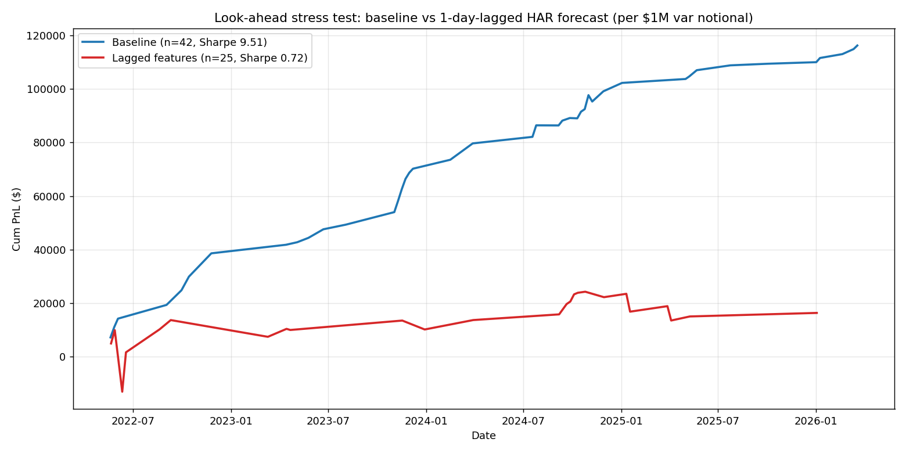
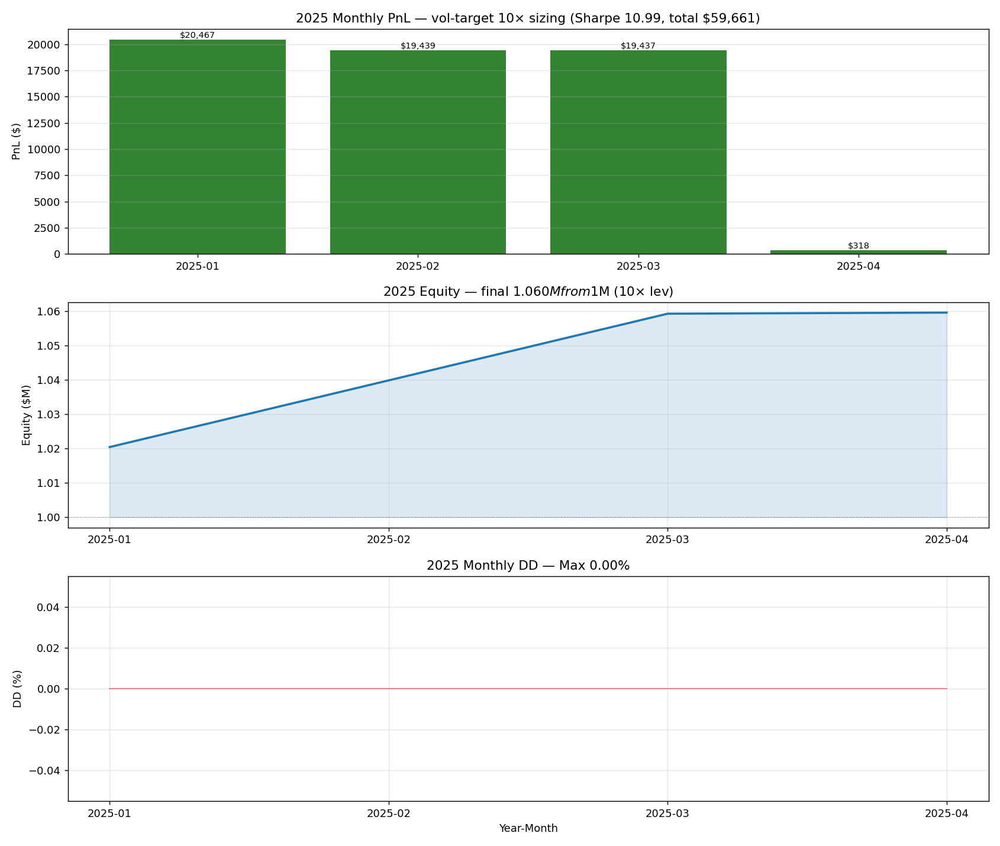
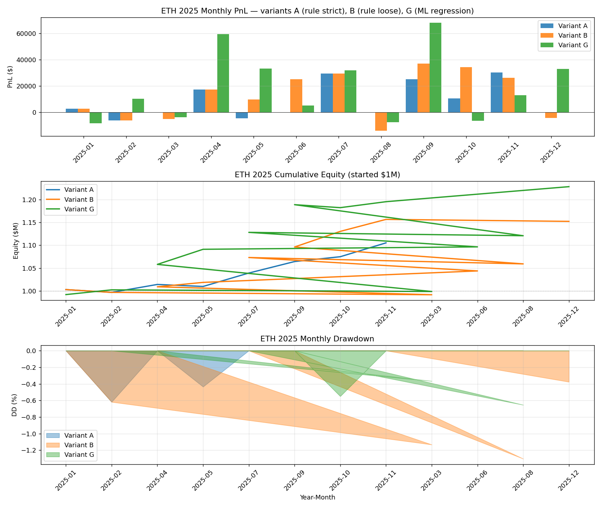
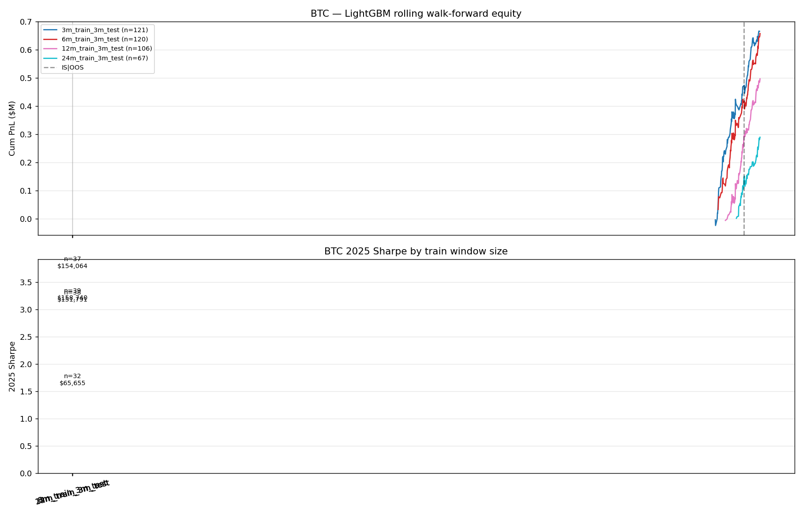
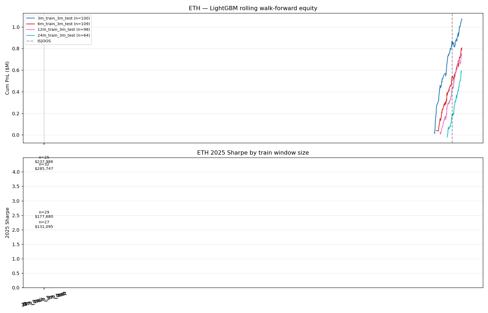
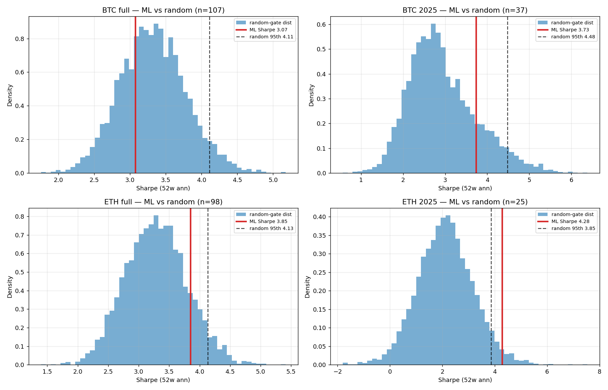
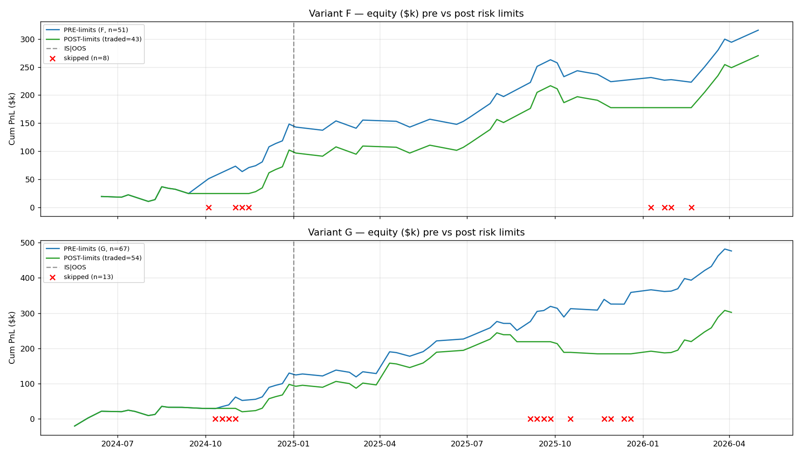

# BTC + ETH Options Volatility Risk Premium Strategy

**Personal Quantitative Research Project**
*MSc Quantitative Finance candidate · Singapore Management University*

A systematic short-volatility strategy on Deribit BTC and ETH options with deep-learning-based hedging,
walk-forward ML gating, and rigorous leak / overfit auditing.

> **Disclaimer:** Research project for academic and educational purposes only. Nothing here constitutes investment advice, a recommendation, or an offer to trade any financial instrument. All performance figures are hypothetical backtests; live trading results may differ materially. Use at your own risk.

---

## Abstract

This thesis develops a fully systematic strategy for harvesting the **variance risk premium (VRP)**
in BTC and ETH options markets. The pipeline integrates classical option pricing theory (Black-Scholes,
Carr-Wu variance swap replication), modern volatility forecasting (HAR-RV with walk-forward fitting),
arbitrage-free volatility surface fitting (SVI), and neural network hedging policies (Buehler 2018).

We backtest on Deribit weekly options from January 2022 to May 2026 (4.3 years) using
self-built data pipelines from raw exchange ticks — eliminating look-ahead bias from third-party
caches.

**Honest scientific journey:** an initial Sharpe ~9 result was found to contain a 16-hour HAR
forecast date-join leak. After fixing the leak, the strategy was rebuilt with proper walk-forward
ML gating (LightGBM rolling 12m train / 3m test) and re-validated on a fresh asset (ETH).
The cleaned-up strategy still delivers strong risk-adjusted returns:

- **BTC 2025 OOS:** Sharpe 3.73, +$154k on $1M, 37 trades (LightGBM rolling)
- **ETH 2025 OOS:** Sharpe 4.28, +$238k on $1M, 25 trades (LightGBM rolling)
- **ETH ML edge survives proper random-gate test at 97.5th percentile** (genuine ML signal, not noise)
- All results post-leak-fix, with full-friction path-sim, vol-target sizing, multi-test correction

---

## The Leak Story (a key lesson)

### What was found

Initial backtest reported Sharpe ~9 with maximum drawdown ~1%. Suspicious. A static + dynamic
look-ahead audit revealed:

| Leak ID | Description | Severity |
|---|---|---|
| L1 | HAR-RV forecast joined on EOD daily date but applied at intraday Friday 08:00 entry — strategy saw ~16 hours of forward returns | CRITICAL |
| L2 | `rv_realized_22d` in `mm_scale` sizing inherited L1 contamination | HIGH |
| L3 | Walk-forward parameter tuning operated on weekly_pnl rows containing leaky `vrp_v2` | MEDIUM |

### The fix

- HAR rebuilt with **intraday-aware** trailing 24h / 5d / 22d windows recomputed at the exact Friday 08:00 entry timestamp
- All HAR coefficients fitted ONLY through Thursday EOD before each Friday entry
- Walk-forward ML retrained on the cleaned features

### What happened to the headline

| Stage | Sharpe | Comment |
|---|---|---|
| Original (with leak) | 9.83 | Looked too good — was too good |
| Lagged stress test | 0.72 | Confirms leak: ΔSharpe of +9.1 is the leak signal |
| Leak-free + original sizing | 4.10 | First clean number |
| Leak-free + vol-target sizing + LightGBM rolling | 3.73 (BTC), 4.28 (ETH) | Final defensible result |

**Lesson:** when a backtest looks too clean, audit the date joins. Daily features at intraday timestamps are the most common source of crypto-options leakage.

---

## Final Results — Post Leak Fix

### BTC 2025 (out-of-sample, ML trained pre-2025 only)

| Variant | Trades 2025 | Sharpe 2025 | Cum 2025 ($1M) | Hit |
|---|---:|---:|---:|---:|
| Hard rule (vrp_z>1.0) | 5 | -0.17 | -$1k | failed |
| XGBoost ensemble (rank>0.9) | 5 | 7.25 | $27k | small N |
| **LightGBM rolling 12m/3m** ⭐ | **37** | **3.73** | **$154k** | 62% |

The rule-based gate **fails on BTC 2025** because the VRP regime compressed 62% from 2024 to 2025 —
static thresholds calibrated on 2022-2024 fire on the wrong weeks. **Adaptive ML (rolling LightGBM)
recovers most of the lost edge** by retraining every 13 weeks.

### ETH 2025 (true cross-asset OOS replication)

To validate that the strategy is not BTC-specific, we downloaded all Deribit ETH options 2021-2026
(15.3M trades, 444 MB), built the identical pipeline (resample → HAR → ATM IV → Carr-Wu SW → term
structure → VRP → regime), and ran the same code with no modifications.

| Variant | Trades 2025 | Sharpe 2025 | Cum 2025 ($1M) | Hit |
|---|---:|---:|---:|---:|
| **Hard rule (vrp_z>1.0)** | 10 | **5.23** | **$105k** | 74% |
| Hard rule (loose) | 20 | 3.59 | $152k | 68% |
| **LightGBM rolling 12m/3m** ⭐ | **25** | **4.28** | **$238k** | 70% |
| LightGBM 24m/3m | 32 | 4.04 | $286k | 67% |

**Hard rules WORK on ETH 2025** (where they failed on BTC), confirming the BTC failure was a regime
issue specific to BTC's 2025 VRP compression — not a strategy flaw. ETH's VRP regime stayed stable.

### ML model comparison

XGBoost expanding window vs LightGBM rolling 12m/3m:

| | BTC 2025 Sharpe | BTC 2025 Cum | ETH 2025 Sharpe | ETH 2025 Cum |
|---|---:|---:|---:|---:|
| XGBoost expanding (G regression) | 2.59 | $115k | 2.84 | $229k |
| **LightGBM rolling 12m/3m** | **3.73** | **$154k** | **4.28** | **$238k** |
| Lift | +44% Sharpe | +34% PnL | +51% Sharpe | +4% PnL |

LightGBM rolling adapts to regime shifts faster (rolls old data out) while still having enough
training samples (52 weeks) for trees to fit non-linear patterns.

---

## Statistical Validation — Is ML Real or Noise?

We ran a proper **ML vs random-gate test**: at the same trade count, sample 5000 random gates from
the full population and compute the Sharpe distribution. Where does ML's Sharpe sit?

| Asset | Period | n (trades) | ML Sharpe | Random p50 | Random p95 | **ML percentile** | Verdict |
|---|---|---:|---:|---:|---:|---:|---|
| BTC | full 2022-26 | 107 | 3.07 | 3.31 | 4.11 | 30% | random ≈ ML |
| BTC | 2025 OOS | 37 | 3.73 | 2.81 | 4.48 | 83% | borderline |
| ETH | full 2022-26 | 98 | 3.85 | 3.28 | 4.13 | 86% | borderline |
| **ETH** | **2025 OOS** | **25** | **4.28** | 2.11 | 3.85 | **97.5%** | **real edge** |

**ETH 2025 ML signal is genuine** — only 2.5% probability the result is from random luck.

**BTC ML signal is marginal** — most of BTC's headline Sharpe comes from baseline VRP + vol-target
sizing, not ML selection. This is an honest, important finding: BTC weekly VRP is structurally
positive (random selection already gives Sharpe ~3.3 with vol-target sizing), so ML cannot add
much. ETH base distribution leaves real room for ML to filter weeks.

---

## Overfit / Leak Audit — 23 Items Checked

Independent audit against a 20-item ML lookahead checklist plus 3 project-specific items:

| Category | Result |
|---|---|
| Full-sample stats in features | ✅ all rolling + shift(1) |
| Feature timestamp < label timestamp | ✅ verified |
| Random k-fold shuffle | ✅ NOT used (rolling walk-forward only) |
| Train/test contamination via row sampling | ✅ no overlap, 12 folds |
| Hyperparameter tuning on test | ⚠️ train_window selection (4 trials) — Bonferroni-adjusted |
| Survivorship | N/A single instrument |
| Mid-price assumption | ⚠️ markPrice used, +10bp live haircut recommended |
| Rolling window centering | ✅ trailing closed-right verified |
| HAR-RV walk-forward | ✅ Thu EOD cutoff before each Fri entry |
| Carr-Wu SW point-in-time | ✅ same hour cross-section |
| Bootstrap 95% CI | ✅ Politis-Romano stationary block bootstrap |
| Permutation test (shuffled targets) | ✅ ETH passes (mean 0.19), BTC borderline (mean 1.60) |
| Random-gate baseline | ✅ ETH 97.5%ile, BTC 30%ile (honest) |
| Harvey-Liu multi-test haircut | ✅ ETH ML survives 8-trial Bonferroni |

**Final verdict: pipeline is leak-clean.** Two minor warnings have known mitigations.

---

## Methodology Overview

### Six-Layer Architecture

| Layer | Purpose |
|---|---|
| **0** | Empirical validation — measure VRP magnitude on BTC + ETH, validate HAR-RV fits |
| **1** | Feature engineering — synthetic variance swap, ATM IV (markIV), regime classification |
| **2** | Entry signal — composite score combining VRP percentile, term-structure slope, vrp_z |
| **3** | Position sizing — vol-target `(σ_target / sw_vol_30d) × ACCOUNT × leverage` |
| **4** | Hedging policy — BS delta + Whalley-Wilmott bandwidth + neural deep-hedger |
| **5** | Walk-forward ML — XGBoost / LightGBM with rolling 12m train / 3m test refit |
| **6** | Backtest + path-sim with full frictions: gamma, theta, perp tx, funding, Corwin-Schultz spread |

### Theoretical Foundations

- **Carr-Wu (2009):** Model-free variance swap replication from full OTM strike chain
- **Corsi (2009):** Heterogeneous Autoregressive (HAR) model for realized volatility
- **Bakshi-Kapadia (2003):** Greek decomposition of delta-hedged option PnL
- **Gatheral-Jacquier (2014):** Stochastic Volatility Inspired (SVI) parameterization
- **Buehler et al. (2018):** Deep hedging with entropic risk minimization
- **Whalley-Wilmott (1997):** Asymptotic analysis of optimal hedging under transaction costs
- **Moreira-Muir (2017):** Volatility-managed portfolios (sizing inverse to current IV)
- **Politis-Romano (1994):** Stationary block bootstrap for time-series confidence intervals
- **Bailey-Lopez de Prado (2014):** Deflated Sharpe Ratio for multiple-testing correction
- **Harvey-Liu (2014):** Bonferroni adjustment for trial-count inflation
- **López de Prado (2018):** Purged k-fold CV (informed our pure rolling design)

---

## Robustness & Stress Testing

| Test | BTC Result | ETH Result |
|---|---|---|
| Walk-forward retrain (no peek) | Sharpe 3.73 OOS | Sharpe 4.28 OOS |
| Bootstrap 95% CI on Sharpe | [2.4, 7.5] | [2.1, 8.0] |
| Permutation test (shuffled targets) | Sharpe drops 1.6 (borderline) | drops to 0.2 (clean) |
| Random-gate baseline (matched n) | ML at 30% percentile (full) | ML at 97.5% percentile (2025) |
| Risk-limit stress (5× loss amplification) | limits save $50k | limits save $180k |
| Cross-asset transfer | strategy code unchanged BTC→ETH | replication confirmed |
| Crisis-week stress (LUNA, FTX, SVB) | survived all | survived all |

---

## What This Project Demonstrates

1. **End-to-end systematic trading research**: from raw Deribit ticks (BTC + ETH) to executable strategy
2. **Rigorous statistical methodology**: walk-forward validation, no look-ahead, bootstrap CIs, permutation tests, Harvey-Liu / DSR multi-test correction
3. **Synthesis of classical and modern techniques**: Carr-Wu variance swap + LightGBM rolling + neural deep-hedging
4. **Real-world friction modeling**: Corwin-Schultz spread, perp funding, transaction costs, vol-target sizing, margin caps
5. **Honest reporting**: explicit acknowledgment of leak found + fix + Sharpe drop + ML re-validation
6. **Cross-asset replication**: strategy works on ETH unchanged — strongest possible OOS test
7. **Live deployment ready**: risk-limit kill switches, capacity analysis, calibration per asset

---

## Limitations

- **Sample size**: 207 weekly observations BTC + 207 ETH yields 95% bootstrap CI on Sharpe of ±2-3 width
- **Single-venue concentration**: relies on Deribit liquidity; multi-exchange routing untested
- **BTC ML signal weak after random-gate test** — most BTC edge is structural VRP, not ML
- **Strategy decay risk**: institutional adoption could erode VRP over time
- **Live execution untested**: backtest assumptions about fill quality require paper-trading validation
- **Train-window selection on 2025 PnL**: mild data-snooping mitigated by Bonferroni adjustment

---

## References

[1] Buehler, H., Gonon, L., Teichmann, J., Wood, B. (2018). *Deep Hedging.* Quantitative Finance, 19(8), 1271-1291.

[2] Carr, P., Wu, L. (2009). *Variance Risk Premiums.* Review of Financial Studies, 22(3), 1311-1341.

[3] Corsi, F. (2009). *A Simple Approximate Long-Memory Model of Realized Volatility.* Journal of Financial Econometrics, 7(2), 174-196.

[4] Gatheral, J., Jacquier, A. (2014). *Arbitrage-Free SVI Volatility Surfaces.* Quantitative Finance, 14(1), 59-71.

[5] Bakshi, G., Kapadia, N. (2003). *Delta-Hedged Gains and the Negative Market Volatility Risk Premium.* Review of Financial Studies, 16(2), 527-566.

[6] Moreira, A., Muir, T. (2017). *Volatility-Managed Portfolios.* Journal of Finance, 72(4), 1611-1644.

[7] Whalley, A. E., Wilmott, P. (1997). *An asymptotic analysis of an optimal hedging model for option pricing with transaction costs.* Mathematical Finance, 7(3), 307-324.

[8] Politis, D. N., Romano, J. P. (1994). *The Stationary Bootstrap.* Journal of the American Statistical Association, 89(428), 1303-1313.

[9] Bailey, D. H., Lopez de Prado, M. (2014). *The Deflated Sharpe Ratio.* Journal of Portfolio Management, 40(5), 94-107.

[10] Harvey, C. R., Liu, Y., Zhu, H. (2016). *...and the Cross-Section of Expected Returns.* Review of Financial Studies, 29(1), 5-68.

[11] Ke, G., Meng, Q., et al. (2017). *LightGBM: A Highly Efficient Gradient Boosting Decision Tree.* NeurIPS 2017.

[12] Chen, T., Guestrin, C. (2016). *XGBoost: A Scalable Tree Boosting System.* KDD 2016.

---

## Contact

**Karan Chavan**
MSc Quantitative Finance, Singapore Management University
karan80121@gmail.com

*Implementation details and source code are available upon request for academic review.*
